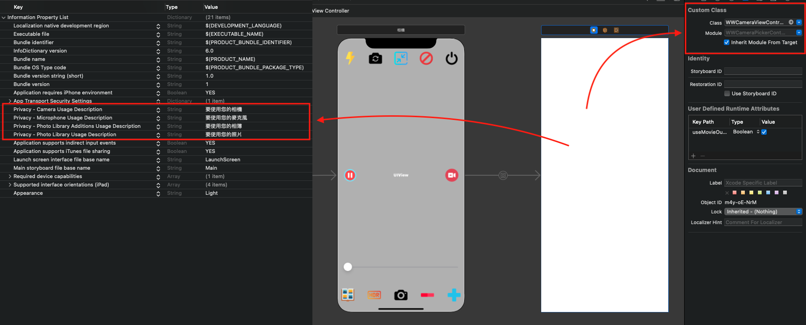

# WWCameraPickerController
[](https://developer.apple.com/swift/) [](https://developer.apple.com/swift/) [](https://developer.apple.com/swift/) [](https://developer.apple.com/swift/)

The enhanced version of [UIImagePickerController](https://medium.com/彼得潘的試煉-勇者的-100-道-swift-ios-app-謎題/77-搭配-uiimagepickercontroller-選照片-ed2b2423b7a9) made by [AVFoundation](https://www.appcoda.com.tw/avfoundation-camera-app/), with higher customization functions, is more convenient when using the camera to take photos.

使用[AVFoundation](https://www.appcoda.com.tw/avfoundation-camera-app/)製作的[UIImagePickerController](https://medium.com/彼得潘的試煉-勇者的-100-道-swift-ios-app-謎題/77-搭配-uiimagepickercontroller-選照片-ed2b2423b7a9)加強版本，更高的自訂功能，在使用相機拍攝照片時，更加的方便。


### [Installation with Swift Package Manager](https://medium.com/彼得潘的-swift-ios-app-開發問題解答集/使用-spm-安裝第三方套件-xcode-11-新功能-2c4ffcf85b4b)
```
dependencies: [
    .package(url: "https://github.com/William-Weng/WWCameraPickerController.git", .upToNextMajor(from: "1.0.0"))
]
```

### Example


```swift
import UIKit
import WWPrint
import WWCameraPickerController

final class ViewController: UIViewController {
    
    @IBOutlet weak var zoomSlider: UISlider!
    
    private var cameraViewController: WWCameraViewController?
    private var zoomRate: CGFloat = 0.5
    
    override func viewDidLoad() {
        super.viewDidLoad()
        takePhotoAction()
    }
    
    override func prepare(for segue: UIStoryboardSegue, sender: Any?) {
        
        guard let viewController = segue.destination as? WWCameraViewController,
              let zoomRange = viewController.cameraZoomRange()
        else {
            return
        }
        
        cameraViewController = viewController
        zoomSlider._setting(value: Float(zoomRange.min), max: Float(zoomRange.max), min: Float(zoomRange.min), isContinuous: true)
    }
    
    @IBAction func startRunning(_ sender: UIButton) { cameraViewController?.startRunning() }
    @IBAction func stopRunning(_ sender: UIButton) { cameraViewController?.stopRunning() }
    @IBAction func capturePhoto(_ sender: UIButton) { cameraViewController?.capturePhoto() }
    @IBAction func flashModeSetting(_ sender: UIButton) { cameraViewController?.flashModeSetting(.on) }
    @IBAction func switchCamera(_ sender: UIButton) { _ = cameraViewController?.switchCamera() }
    @IBAction func previewLayerRateSetting(_ sender: UIButton) { cameraViewController?.previewLayerRateSetting(sessionPreset: .photo, videoGravity: .resizeAspect) }
    @IBAction func caremaZoomIn(_ sender: UIButton) { _ = cameraViewController?.cameraZoomIn(with: 0.5) }
    @IBAction func caremaZoomOut(_ sender: UIButton) { _ = cameraViewController?.cameraZoomOut(with: 0.5) }
    @IBAction func caremaZoom(_ sender: UISlider) { _ = cameraViewController?.cameraZoom(with: 0.5, factor: CGFloat(sender.value)) }
    @IBAction func userAlbum(_ sender: UIButton) { cameraViewController?.album() }
    @IBAction func cameraHDR(_ sender: UIButton) { _ = cameraViewController?.cameraHDR(isEnable: false) }
}

// MARK: - 小工具
extension ViewController {
    
    /// 拍照的相關動作 (拍照 => 存照片)
    /// NSCameraUsageDescription / NSPhotoLibraryAddUsageDescription / NSPhotoLibraryUsageDescription
    private func takePhotoAction() {
        
        guard let cameraViewController = cameraViewController else { return }
        
        cameraViewController.takePhoto({ result in
            
            switch result {
            case .failure(let error): wwPrint(error)
            case .success(let photo):
                
                cameraViewController.saveImage(photo._image(), result: { _result in
                    switch _result {
                    case .failure(let error): wwPrint(error)
                    case .success(let isSuccess): wwPrint(isSuccess)
                    }
                })
            }
        })
    }
}
```
